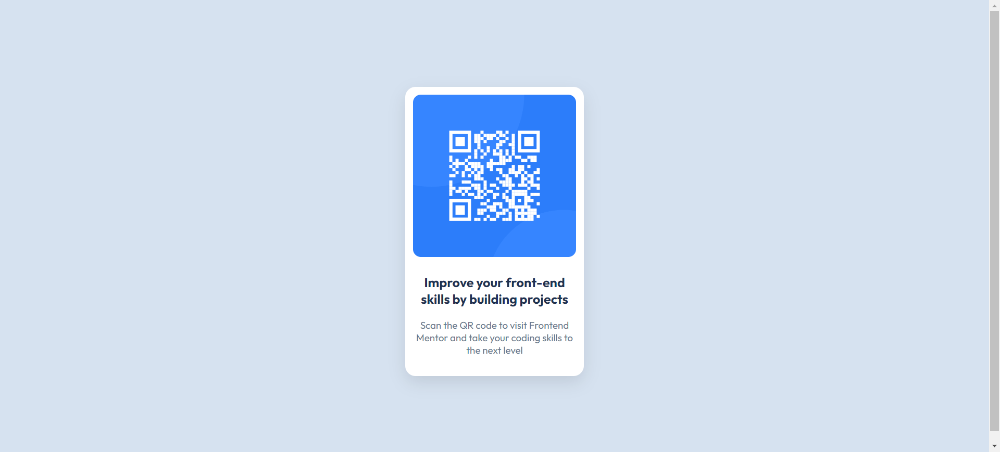
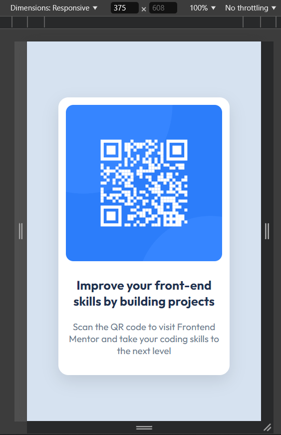

# Frontend Mentor - QR code component solution

This is a solution to the [QR code component challenge on Frontend Mentor](https://www.frontendmentor.io/challenges/qr-code-component-iux_sIO_H).

## Table of contents

  - [Screenshot](#screenshot)
  - [Links](#links)
  - [My process](#my-process)
  - [Built with](#built-with)
  - [What I learned](#what-i-learned)
  - [Continued development](#continued-development)
  - [Author](#author)

**Note: Delete this note and update the table of contents based on what sections you keep.**

### Screenshot

Here is a screenshot of the final result of the project I worked on.

Desktop - 1440px width

Mobile - 375px width

### Links

- Solution URL: [GitHub Repository](https://github.com/Nakhaa/simple-qr-code-project.git)
- Live Site URL: [QR Code Component](https://nakhaa.github.io/simple-qr-code-project/)

## My process

I made this by utilizing a container that acts as an inner container to hold the image and two paragraphs. Next, the container is nested inside another container for the purpose of centering all the existing content. To center, I made the outermost container as a flexbox with a height of 100vh, then made the justify-content and align-items properties to center. After that, I perfected the result by adding the styles.

### Built with

- HTML5
- CSS
- Flexbox

### What I learned

The important thing I learned was how to center an element (or in this case container) vertically using flexbox and set the height to 100vh.

### Continued development

Currently I still don't understand how to center elements, both vertically and horizontally. I hope to perfect the technique I use in the future. feel free to give me suggestions, input and criticism.

## Author

- Frontend Mentor - [@Nakhaa](https://www.frontendmentor.io/profile/nakhaa)
- Instagram - [@m_nakhaa](https://www.instagram.com/m_nakhaa)

## Disclaimer
Sorry for my language mistakes. English is not my first language, but i hope to master it in the future :).